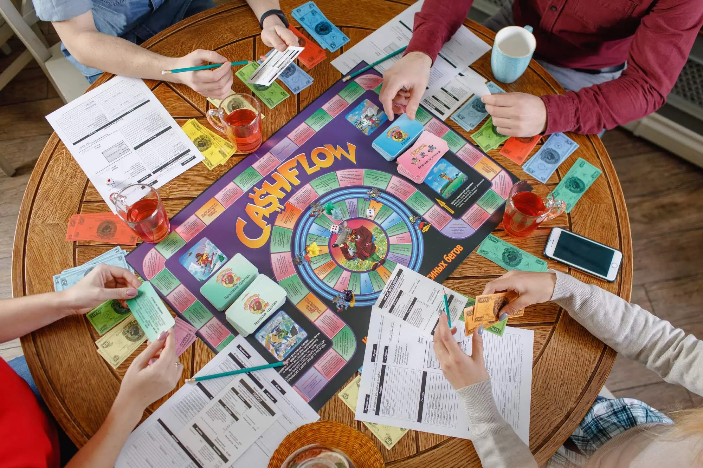
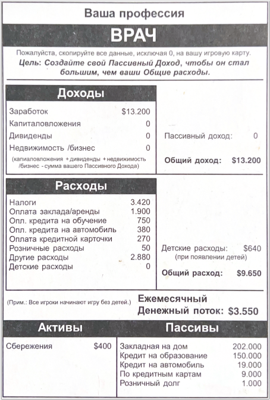
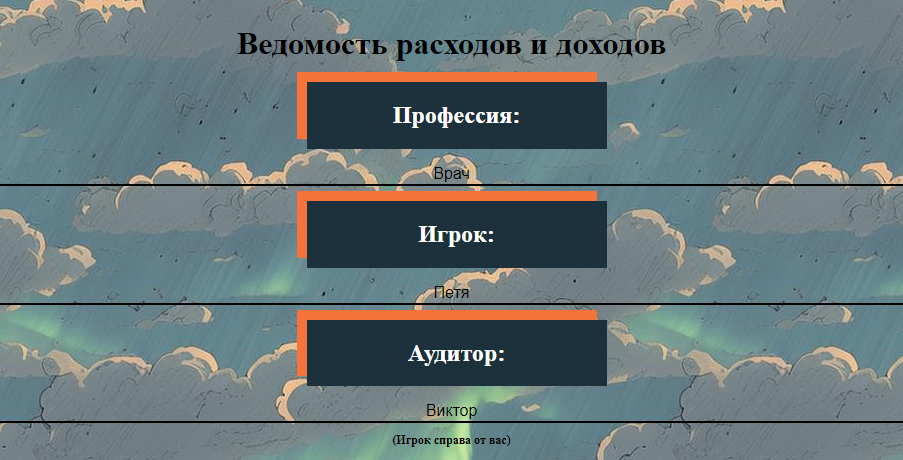
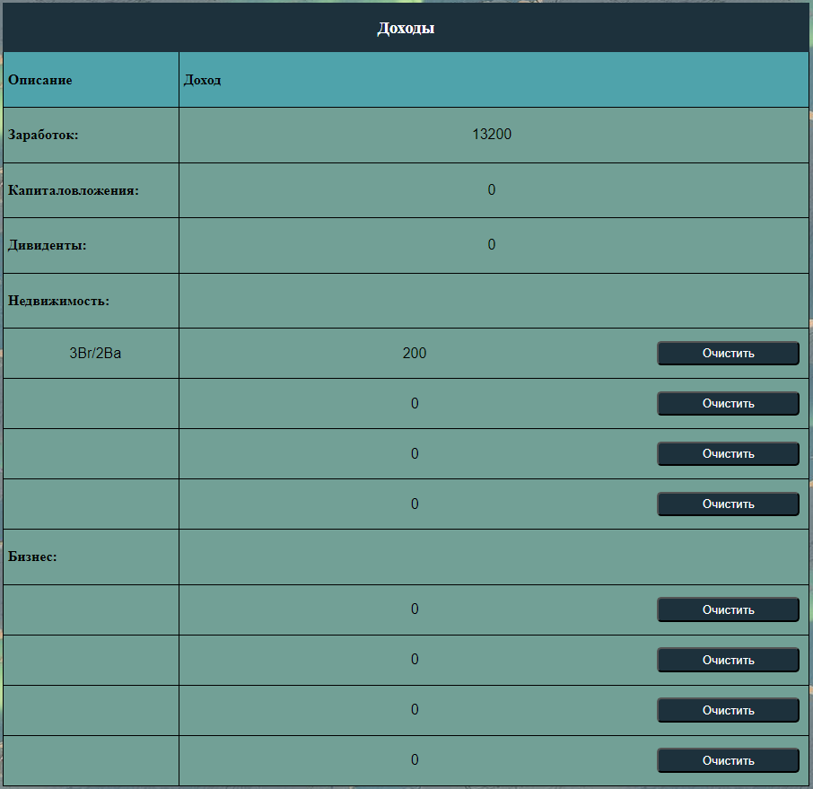
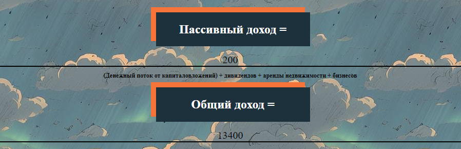
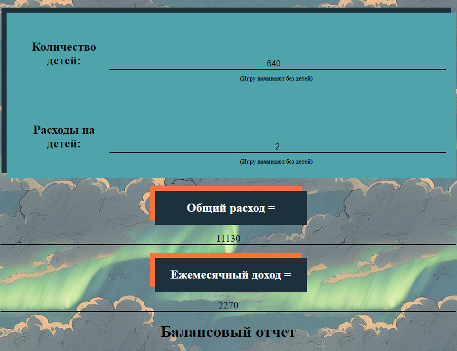
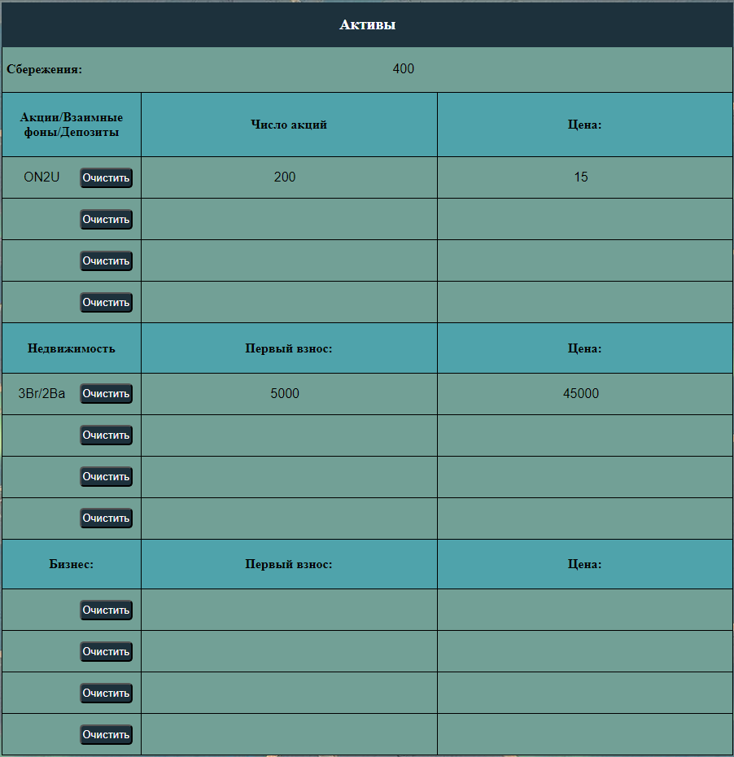
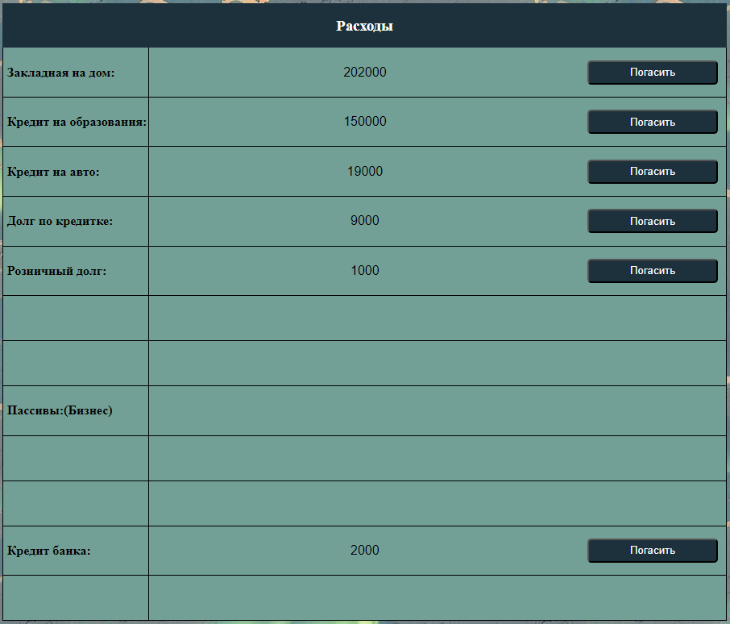
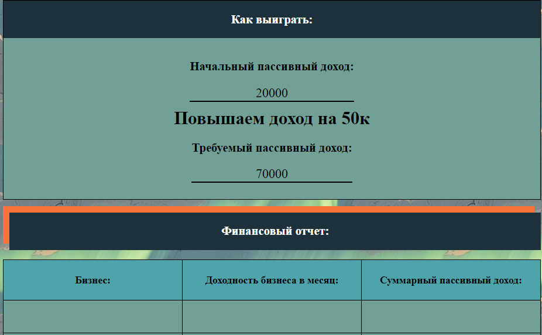

# Денежный поток
Проект создан для упрощения подсчетов в настольной игре "Денежный поток". Все что вам нужно для использования калькулятора это набор игры  "Денежный поток" - 101 версия.

## Инструкция
В наборе игры есть карточки с профессиями, возьмите карточку и заполните ее согласно пунктам. Все вычесления производятся автоматически, вам ничего считать не нужно.

### Скриншоты
Пример  заполнения карточки с профессией "Врач".

